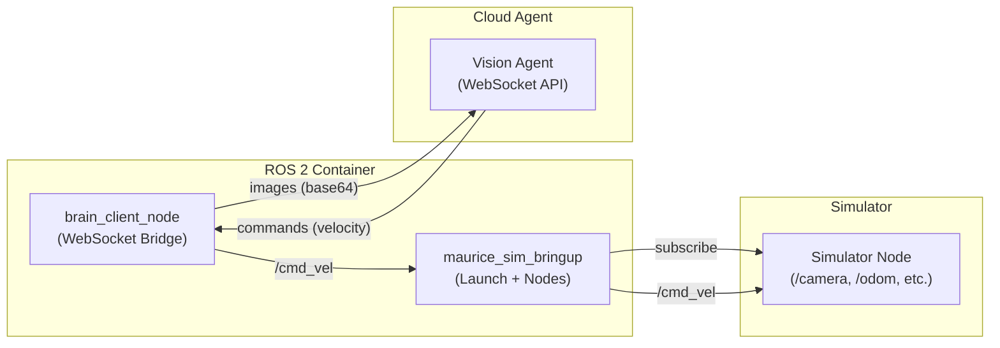
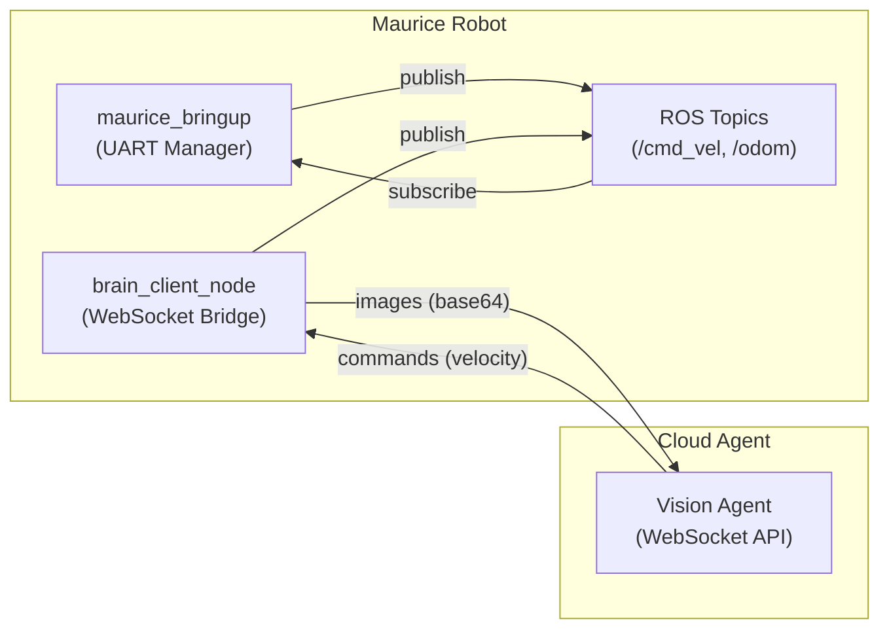

# Maurice Robot System Documentation

This repository contains the code, configuration, and documentation for the Maurice robot system. The system can run in two modes:

1. **Simulation Mode**: Where a simulator publishes mock sensor data (images, LiDAR, etc.) to ROS, and we run the same ROS nodes that would run on the real robot.
2. **Real-World Mode**: Where the Maurice robot hardware (via UART/TCP or actual hardware drivers) publishes real sensor data, and receives real actuation commands.

Below is an overview of each major component, the communication protocols, and relevant message/service definitions.

---

## Table of Contents

- [Overall Architecture](#overall-architecture)
- [Components](#components)
  - [Maurice Robot / Simulation](#maurice-robot--simulation)
  - [ROS 2 Nodes & Packages](#ros-2-nodes--packages)
  - [Cloud Agent](#cloud-agent)
  - [Zenoh Discovery & Networking](#zenoh-networking)
  - [rosbridge](#rosbridge)
- [Protocols and Message Types](#protocols-and-message-types)
  - [ROS 2 Topics & Services](#ros-2-topics--services)
  - [Custom WebSocket Protocol](#custom-websocket-protocol)
  - [DDS Discovery Protocol](#dds-discovery-protocol)
- [System Diagrams](#system-diagrams)
  - [Simulation Diagram](#simulation-diagram)
  - [Real Robot Diagram](#real-robot-diagram)
- [Build and Run Instructions](#build-and-run-instructions)
  - [Docker & Docker Compose](#docker--docker-compose)
  - [Local Development](#local-development)
- [FAQ / Troubleshooting](#faq--troubleshooting)

---

## Overall Architecture

**Core Idea**: We have a set of ROS 2 nodes that handle sensor input, motion commands, and external communication (cloud, simulator).  
- In **simulation mode**, a simulator node (or an external sim bridging over rosbridge) publishes mock data (e.g. images, LiDAR) to ROS.  
- In **real-world mode**, the hardware drivers (or a `UartManager`, `TcpManager`, etc.) publish **actual** sensor data.  

A **cloud agent** connects via WebSockets to our `brain_client_node` (or similar). The agent can request images, command velocities, etc. Meanwhile, we also have a `rosbridge_server` that can allow external simulator connections.

---

## Components

Below is a brief description of each major piece. In the repository, these are located in various subfolders inside `ros2_ws/src`.

### Maurice Robot / Simulation

- **Maurice Robot**: A physical platform running ROS 2 (e.g. on a Jetson or SBC). Publishes topics like `/odom`, `/battery_state`, and receives `/cmd_vel`.  
- **Simulation**: A software environment mimicking the robot's sensors (camera, LiDAR, etc.) and actuators. Publishes the same ROS 2 topics so that the rest of the system thinks it's dealing with a real robot.

### ROS 2 Nodes & Packages

1. **`maurice_msgs`**: Custom message/service definitions (e.g. `LightCommand.srv`).
2. **`maurice_bringup`**: Launch files and nodes for the real robot (UART drivers, battery manager).
3. **`maurice_sim_bringup`**: Launch files and nodes for simulation (TCP manager or direct rosbridge).
4. **`brain_client`**: A node that connects to the cloud agent via WebSocket. This sends images, receives commands, etc.
5. **`dds/`** scripts: Facilitates DDS discovery server usage (setup scripts, XML templates).

### Cloud Agent

A remote server or application that:
- Connects via WebSockets to `brain_client_node`.
- Requests images (`ready_for_image`) and receives them as base64-encoded JPEG.
- Issues commands (`action_to_do`) that become `/cmd_vel` in ROS 2.

### Zenoh Networking

- We can run a **Zenoh Router** (`rmw_zenohd`), so that distributed ROS 2 nodes find each other on the network without heavy multicast.

NOTE: Discovery between hosts is currently untested after the Zenoh migration

- The environment variables `ROS_DISCOVERY_SERVER` or `FASTRTPS_DEFAULT_PROFILES_FILE` (with a generated XML) control how DDS is configured.

### rosbridge

- We may also run a **rosbridge_server** (port 9090) so that external simulators or web applications can subscribe/publish via JSON over WebSockets (`/odom`, `/cmd_vel`, etc.).

---

## Protocols and Message Types

### ROS 2 Topics & Services

Below is a summary of the main ROS 2 topics and services used. They are standard or custom:

| Topic/Service            | Type                              | Description                                                            |
|--------------------------|------------------------------------|------------------------------------------------------------------------|
| `/odom`                  | `nav_msgs/msg/Odometry`           | Robot's odometry data                                                  |
| `/camera/color/image_raw`| `sensor_msgs/msg/Image`           | RGB camera feed from either real or simulated source                   |
| `/cmd_vel`               | `geometry_msgs/msg/Twist`         | Velocity commands to drive the robot                                  |
| `/battery_state`         | `sensor_msgs/msg/BatteryState`    | Battery information                                                    |
| `/light_command`         | `maurice_msgs/srv/LightCommand`   | Custom service for controlling robot lights                            |
| …                        | …                                  | (Add more as needed)                                                   |

### Custom WebSocket Protocol

**Between** `brain_client_node` and the external cloud agent. Example messages:
- **`{ "type": "ready_for_image" }`**: means the cloud agent wants the latest camera frame.  
- **`{ "type": "image", "image_b64": "..." }`**: base64-encoded JPEG frame.  
- **`{ "type": "action_to_do", "cmd": "set_velocity", "values": [0.5, 0.0] }`**: instruct robot to move.  
- etc.

### DDS Discovery Protocol

Note: Discovery between hosts is currently untested after the Zenoh migration

If using **Fast DDS SUPER_CLIENT** configuration:
- The client node sets `ROS_DISCOVERY_SERVER=<IP>:<PORT>`.
- We place a `super_client_configuration.xml` referencing the server IP/Port.  
- The discovery server runs `fastdds discovery -p <PORT> -i <ID>` on the host or a separate machine.

---

## System Diagrams

Below are two conceptual diagrams: one for **simulation**, one for the **real robot**. You can embed them in your markdown in a few ways:

1. **Mermaid** (GitHub now renders Mermaid diagrams directly).
2. **PlantUML** (requires a plug-in or pre-rendered images).
3. **Static Image** (e.g. PNG or SVG).

### Simulation Diagram

Mermaid Example

### Real Robot Diagram

Mermaid Example

